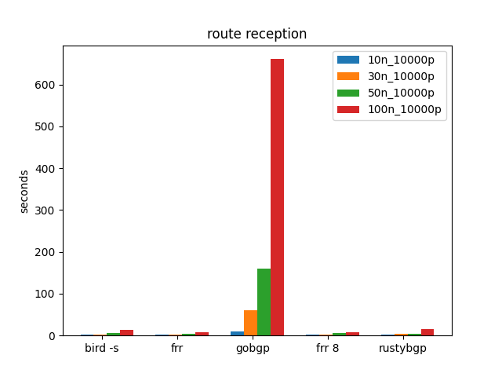
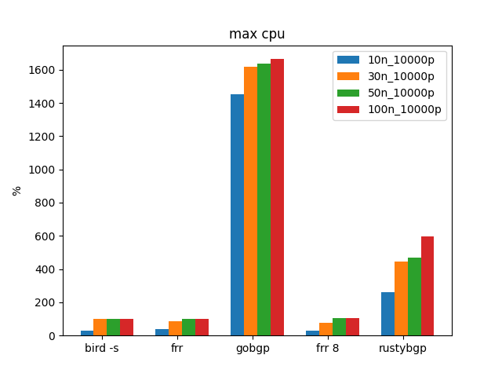
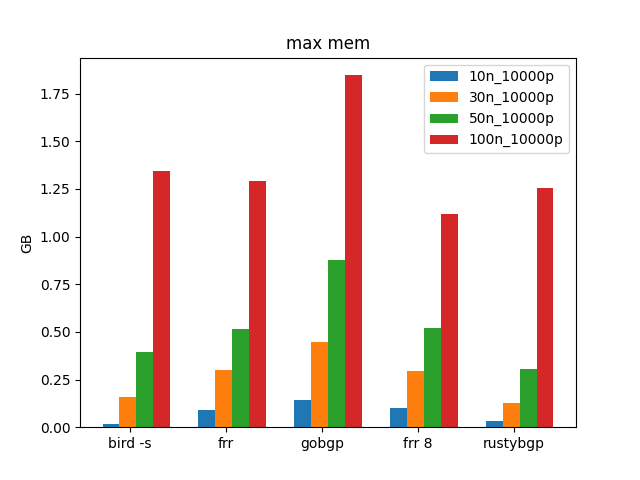

bgperf
========

bgperf is a performance measurement tool for BGP implementation.

* [How to install](#how_to_install)
* [How to use](#how_to_use)
* [How bgperf works](https://github.com/osrg/bgperf/blob/master/docs/how_bgperf_works.md)
* [Benchmark remote target](https://github.com/osrg/bgperf/blob/master/docs/benchmark_remote_target.md)
* [MRT injection](https://github.com/osrg/bgperf/blob/master/docs/mrt.md)

## Updates
I've changed bgperf to work with python 3 and work with new versions of all the NOSes. It actually works, the original version that this is a fork of does not work anymore because of newer version of python and each of the routing stacks.

 This version no longer compiles EXABGP or FRR, it gets PIP or containers already created. Quagga has been removed since it doesn't seem to be updated anymore.

To get bgperf to work with all the changes in each stack  I've had to change configuration. I 
don't know if all the features of bgperr still work: I've gotten the simplest version of
each config to work.

Caveats: 

I don't know if adding more policy will still work for all targets.
I haven't tested MRT or remote targets.


## Prerequisites

* Python 3.7 or later
* Docker

##  <a name="how_to_install">How to install

```bash
$ git clone https://github.com:jopietsch/bgperf.git
$ cd bgperf
$ pip3 install -r pip-requirements.txt
$ ./bgperf.py --help
usage: bgperf.py [-h] [-b BENCH_NAME] [-d DIR]
                 {doctor,prepare,update,bench,config} ...

BGP performance measuring tool

positional arguments:
  {doctor,prepare,update,bench,config}
    doctor              check env
    prepare             prepare env
    update              pull bgp docker images
    bench               run benchmarks
    config              generate config

optional arguments:
  -h, --help            show this help message and exit
  -b BENCH_NAME, --bench-name BENCH_NAME
  -d DIR, --dir DIR
$ ./bgperf.py prepare
$ ./bgperf.py doctor
docker version ... ok (1.9.1)
bgperf image ... ok
gobgp image ... ok
bird image ... ok
```
## <a name="how_to_use">How to use

Use `bench` command to start benchmark test.
By default, `bgperf` benchmarks [GoBGP](https://github.com/osrg/gobgp).
`bgperf` boots 100 BGP test peers each advertises 100 routes to `GoBGP`.

```bash
$ python3 bgperf.py bench
run monitor
run gobgp
Waiting 5 seconds for neighbor
run tester tester type normal
tester booting.. (100/100)
elapsed: 2sec, cpu: 0.79%, mem: 42.27MB, recved: 10000
gobgp: 2.29.0
Max cpu: 554.03, max mem: 45.71MB
Time since first received prefix: 2
total time: 24.07s

name, target, version, peers, prefixes per peer, neighbor (s), elapsed (s), prefix received (s), exabgp (s), total time, max cpu %, max mem (GB), flags, date,cores,Mem (GB)
gobgp,gobgp,2.29.0,100,100,5,2,0,2,24.07,554,0.045,,2021-08-02,32,62.82GB
```

As you might notice, the interesting statistics are shown twice, once in an easy to read format and the second
in a CSV format to easily copy and paste to do analysis later.

To change a target implementation, use `-t` option.
Currently, `bgperf` supports [BIRD](http://bird.network.cz/) and [FRRouting](https://frrouting.org/)
(other than GoBGP. There is very intial support for[RustyBGP](https://github.com/osrg/rustybgp), partly
because RustyBGP doesn't support all policy that BGPerf tries to use for policy testing. If you just want to
do routes and neighbors then RustyBGP works.

```bash
$ python3 bgperf.py bench -t bird
run monitor
run bird
Waiting 4 seconds for neighbor
run tester tester type normal
tester booting.. (100/100)
elapsed: 1sec, cpu: 1.79%, mem: 110.64MB, recved: 10000
bird: v2.0.8-59-gf761be6b
Max cpu: 1.79, max mem: 110.64MB
Time since first received prefix: 1
total time: 20.73s

name, target, version, peers, prefixes per peer, neighbor (s), elapsed (s), prefix received (s), exabgp (s), total time, max cpu %, max mem (GB), flags, date,cores,Mem (GB)
bird,bird,v2.0.8-59-gf761be6b,100,100,4,1,0,1,20.73,2,0.108,,2021-08-02,32,62.82GB
```

To change a load, use following options.

* `-n` : the number of BGP test peer (default 100)
* `-p` : the number of prefix each peer advertise (default 100)
* `-a` : the number of as-path filter (default 0)
* `-e` : the number of prefix-list filter (default 0)
* `-c` : the number of community-list filter (default 0)
* `-x` : the number of ext-community-list filter (default 0)

```bash
$ python3 bgperf.py bench
run monitor
run gobgp
Waiting 5 seconds for neighbor
run tester tester type normal
tester booting.. (100/100)
elapsed: 2sec, cpu: 0.79%, mem: 42.27MB, recved: 10000
gobgp: 2.29.0
Max cpu: 554.03, max mem: 45.71MB
Time since first received prefix: 2
total time: 24.07s

name, target, version, peers, prefixes per peer, neighbor (s), elapsed (s), prefix received (s), exabgp (s), total time, max cpu %, max mem (GB), flags, date,cores,Mem (GB)
gobgp,gobgp,2.29.0,100,100,5,2,0,2,24.07,554,0.045,,2021-08-02,32,62.82GB
```

For a comprehensive list of options, run `python3 ./bgperf.py bench --help`.

## targets

Targets are the container being tested. There are various ways to make target containers. One is to use a 
container that is already created. This is the easiest. The second is to compile the NOS.

The problem is that over time how containers about put in dockerhub and how the stacks are compiled changes.
When I originally forked bgperf it hadn't changed in 4 years, so almost none of the containers could be built
and all of the software had changed how they interat. I'm not sure how best to make bgperf work over time.

Right now that is demonstrated most readily with FRR. If you use bench -t FRR it will use a prebuilt FRRouting 
container that is hardcoded to 7.5.1. However, I've also created another target called frr_c, which is a container
that checks FRRouting out of git with the 8.0 tag and builds the container. This container is not automatically
built when you do bgperf bench.

## batch
A new feature called batch lets you run multiple tests, collect all the data, and produces graphs. It's not 
super robust, if you get any of the expected fields wrong the in the YAML description file it just 
fails.

There is an included file batch_example.yaml that shows how it works. 

If you use a file that looks like this:

```YAML
tests:
  - 
    name: 10K
    neighbors: [10, 30, 50, 100]
    prefixes: [10_000]
    targets: 
      -
        name: bird
        label: bird -s
        single_table: True
      - 
        name: frr
      -
        name: gobgp
      -
        name: frr_c
        label: frr 8
      -
        name: rustybgp
```
You will get output like this:
```bash
name, target, version, peers, prefixes per peer, neighbor (s), elapsed (s), prefix received (s), exabgp (s), total time, max cpu %, max mem (GB), flags, date,cores,Mem (GB)
bird -s,bird,v2.0.8-59-gf761be6b,10,10000,3,2,0,2,13.9,30,0.015,-s,2021-08-02,32,62.82GB
frr,frr,FRRouting 7.5.1_git (910c507f1541).,10,10000,0,3,0,3,11.58,37,0.089,,2021-08-02,32,62.82GB
gobgp,gobgp,2.29.0,10,10000,6,9,0,9,24.65,1450,0.141,,2021-08-02,32,62.82GB
frr 8,frr_c,FRRouting 8.0-bgperf (489e9d4e8956).,10,10000,0,3,0,3,11.61,31,0.1,,2021-08-02,32,62.82GB
rustybgp,rustybgp,exec,10,10000,4,3,0,3,15.94,262,0.032,,2021-08-02,32,62.82GB
bird -s,bird,v2.0.8-59-gf761be6b,30,10000,4,3,0,3,26.99,100,0.161,-s,2021-08-02,32,62.82GB
frr,frr,FRRouting 7.5.1_git (ab68d18f80c7).,30,10000,0,3,0,3,22.53,86,0.302,,2021-08-02,32,62.82GB
gobgp,gobgp,2.29.0,30,10000,5,61,0,61,85.8,1620,0.447,,2021-08-02,32,62.82GB
frr 8,frr_c,FRRouting 8.0-bgperf (750804dc0e98).,30,10000,0,3,0,3,22.21,78,0.296,,2021-08-02,32,62.82GB
rustybgp,rustybgp,exec,30,10000,4,4,0,4,28.09,446,0.128,,2021-08-02,32,62.82GB
bird -s,bird,v2.0.8-59-gf761be6b,50,10000,3,6,0,6,42.35,100,0.396,-s,2021-08-02,32,62.82GB
frr,frr,FRRouting 7.5.1_git (9e4604a042a6).,50,10000,0,4,0,4,35.48,102,0.513,,2021-08-02,32,62.82GB
gobgp,gobgp,2.29.0,50,10000,4,160,0,160,194.23,1638,0.875,,2021-08-02,32,62.82GB
frr 8,frr_c,FRRouting 8.0-bgperf (eb81873b8335).,50,10000,1,6,0,6,36.69,103,0.52,,2021-08-02,32,62.82GB
rustybgp,rustybgp,exec,50,10000,4,5,0,5,40.74,469,0.307,,2021-08-02,32,62.82GB
bird -s,bird,v2.0.8-59-gf761be6b,100,10000,3,13,0,13,91.68,100,1.343,-s,2021-08-02,32,62.82GB
frr,frr,FRRouting 7.5.1_git (8dc6f2f40d8c).,100,10000,1,7,0,7,74.99,101,1.291,,2021-08-02,32,62.82GB
gobgp,gobgp,2.29.0,100,10000,5,661,0,661,724.83,1664,1.846,,2021-08-02,32,62.82GB
frr 8,frr_c,FRRouting 8.0-bgperf (74ac3704b034).,100,10000,1,8,1,7,70.46,103,1.116,,2021-08-02,32,62.82GB
rustybgp,rustybgp,exec,100,10000,6,16,0,16,80.37,597,1.253,,2021-08-02,32,62.82GB
```

It will create graphs and a CSV file of the output.

And some graphs. These are some of the important ones







## Debugging

If it doesn't seem to be working, try with 1 peer and 1 route (-n1 -p1) and make sure
that it connecting. If it's just stuck at waiting to connect to the neighbor, then probably the config is wrong and neighbors are not being established between the monitor (gobgp) and the NOS being tested

You'll have to break into gobgp and the test config.


if you want to see what is happening when the test containers starts, after the test is over (or you've killed it), run 
```docker exec bgperf_bird_target /root/config/start.sh```
that's what bgperf is doing. It creates a /root/config/start.sh command and is running it, so if you run it manually you can see if that command produces output to help you debug.

to clean up any existing docker containers

```docker kill `docker ps -q` ```
```docker rm `docker ps -aq` ```


If you try to change the config, it's a little tricky to debug what's going on since there are so many containers. What bgperf is doing is creating configs and startup scripts in /tmp/bgperf and then copies those to the containers before launching them. It creates three containers: bgperf_exabgp_tester_tester, bgperf_\<target\>_target, and bgperf_monitor. If things aren't working, it's probably because the config for the target is not correct. bgperf puts all the log output in /tmp/bgperf/*.log, but what it doesn't do is capture the output of the startup script.

The startup script is in /tmp/bgperf/\<target\>/start.sh and gets copied to the target as /root/config/start.sh.

In other words, to launch the start.sh and see the output you can run this docker command:

```
$ docker exec bgperf_bird_target /root/config/start.sh
bird: I found another BIRD running.

```
In this case, things were already working, so I'll run ps and kill the old bird and start a new one.

```
$ docker exec bgperf_bird_target ps auxww
USER         PID %CPU %MEM    VSZ   RSS TTY      STAT START   TIME COMMAND
root           1  0.0  0.0   3984  2820 ?        Ss   21:21   0:00 bash
root          14  0.0  0.0   4144  2016 ?        Ss   21:21   0:00 bird -c /root/config/bird.conf
root          22  0.0  0.0   5904  2784 ?        Rs   21:22   0:00 ps auxww
$ docker exec bgperf_bird_target kill 14
```

```
$ docker exec bgperf_bird_target /root/config/start.sh
```
No output, so it was just fine.
